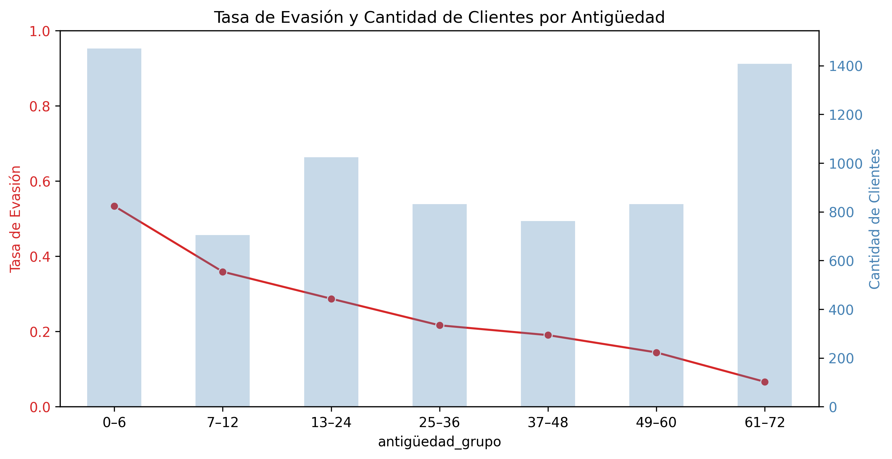

# 📊 Challenge de Evasión de Clientes — TelecomX

Este Challenge se enfocó en realizar una extracción, limpieza y analisis de datos con python, ultizando pandas, matplotlib y seaborn, con el fin de entender por qué los clientes abandonan la empresa TelecomX, mediante un analisis exploratorio basado en un dataset estructurado con información sobre contratos, servicios y comportamiento de los usuarios,etc. A partir de este análisis, se proponen acciones que permitan mejorar la fidelización de clientes y que la empresa telecomX sea rentable en el tiempo.

---

## 🔍 Principales Hallazgos y Explicaciones

### 1. **Tasa de evasión: 26% de los clientes se van de la compañia de telecomunicaciones**

Esto significa que aproximadamente **1 de cada 4 clientes** deja el servicio propuesto por la empresa. Esta tasa es crítica, ya que representa una pérdida directa de ingresos , lo cual supera los margenes aceptables del rubro de telecomunicaciones. Este margen esta en el nivel superior segun punto de vista economico, ya que el rango maximo de evasión ronda para que sea rentable entre un 10 a 25% (Esta empresa tiene un 26%). Y puede estar relacionada con insatisfacción, falta de lealtad o debilidad en la propuesta de valor percibida.

Esto se ve de mejor manera si lo traemos a numeros tangibles en un ejemplo.

Si suponemos que tenemos 100 clientes que captas como muestra y se van 26. Y este costo de adquisición (CAC) es alto, y el valor de vida del cliente es bajo, es probable que no sea rentable y no se pueda recuperar la inversión inicial de adquisición. 

Esto se explicara con mas detalle en el punto siguente con la tasa de retención(antiguedad)

---

### 2. **Antigüedad: los clientes nuevos (0–12 meses) se evaden más**

Se agruparon los clientes por rangos de antigüedad (en meses). El análisis muestra que la **mayor tasa de evasión ocurre en los primeros 6 a 12 meses**. Esto indica que los clientes que recién ingresan:

- Aún no han construido una relación sólida con la empresa.
- Pueden experimentar dificultades en la implementación o servicios defectuosos iniciales.
- Tienen menor compromiso emocional o contractual.
  

🔎 **Interpretación**: Los primeros meses son críticos. Si no se establece confianza y valor desde el principio, el riesgo de abandono es mucho mayor.

Por lo que, retomando el punto anterior con este y dejando el siguente ejemplo podemos ver de mejor manera que esto puede ser peligroso y dejar a la empresa fuera del rubro por no ser rentable. Si nos suponemos como en el punto anterior el CAC es alto y el retorno mensual por cliente es bajo, tenemos :

Costo de Adquisición (CAC) = $150
Ingreso mensual por cliente = $20
Margen neto mensual = $10

Si el cliente con estos datos se va entre en el limite superior de 12 meses te deja una ganancia neta de $120 por lo que estas perdiendo $30 por cada cliente.

---

### 3. **Distribución: mayoría son clientes nuevos y los la mayor parte de los que se van**

La mayoría de los clientes actuales tienen menos de 12 meses de antigüedad y son los que mayormente se van por lo que hay problemas de fidelización del cliente. Esto puede ser a factores, como el valor percibido, o la poca o nula asistencia que puede recibir el cliente, ya sea tecnica o comercial los primeros meses. Ademas, de otros factores que podremos analizar en los puntos siguentes. Por lo tanto, la empresa debe concentrar esfuerzos de retención en este grupo, ya que cualquier mejora tendrá un impacto directo sobre el total de clientes.

---

### 4. **Contrato mensual = Mayor Tasa de Salida**

Al analizar el tipo de contrato (mensual, anual o bianual), se encontró que los clientes con **contratos mensuales presentan la mayor tasa de evasión**. En cambio, los contratos de mayor duración retienen más clientes, ya que al ser un pago unico y por lo general a la larga sale mas barato, por ende podria darse enfasis a este servicio o mejorar las ofertas o insentivos para poder hacer mas atractiva este tipo de contrato o el bi anual tambien.

📌 **Explicación**:
- Los contratos mensuales permiten salir fácilmente, lo que reduce el compromiso.
- En cambio, los contratos anuales o bianuales implican planificación y generalmente ofrecen mejores precios.

Por otro lado embargo, otros factores asociados con la tasa de salida son :

 #Tipo de internet#
 
- Existe una correlación en el mapa de calor entre el tipo de servicio de internet contratado y la mayor cantidad de personas que se van de telecomX (42 %)  esto puede ser debido a problemas especificos con el tipo internet contratado, o el sector en especifico. Ya que este suele ser el mas claro o el que tiene mayor calidad.
  

#Edad#

-La tasa de adulto mayor que deja el servicio es de 42% tambien. Esto se correlaciona al abandono de planes a los pocos meses, ya que por lo general la gente adulta mayor no se maneja mucho con estos servicios y los medios de ayuda al cliente. Por lo que se da a entender que no existe un soporte adecuado, para los problemas recurrentes a los primeros meses de contratación

#Metodo de pago#

En los metodos de pago, el que destaca por una alta salida de clientes es el metodo de electronic check (pago electronico) que no es automatico. Da a entender que el servicio no es muy valorado por los clientes, ya que la no existir un valor percibido o una fidelización fuerte del producto. No dan ganas de hacer el pago manual mediante plataformas de pago electronicas y el cliente, que lo mas seguro tiene contratado un servicio mensual. Se va y deja de pagar.

#Cantidad de dinero gastado#

-En promedio la cantidad de dinero gastado y que se fue no supera a la gente que se quedo. Si se puede ver que ciertos clientes que no son la media, se fueron y gastaron bastante. Por lo que se condice que existe problemas con el servicio al cliente o nulo soporte los primeros meses de contrataciòn. A estos clientes debe darse un trato preferente o mejores servicios asociados a su nivel de plan o dinero invertido en esta ISP.

⚠️ **Riesgo**:
- Si un cliente paga más pero no percibe una mejora clara en el servicio o a la altura del pago que se realiza, es más probable que se frustre y se vaya. Como en los casos expuestos anteriormente
- Perder clientes premium implica perder aun más valor por cliente.(CAC)

---

## 📈 Visualizaciones Relevantes

Se incluyeron:
- **Tasa de evasión por grupo de antigüedad**.
- **Cantidad de clientes por grupo + tasa de evasión** 
- Comparaciones por tipo de contrato, cargo mensual y servicios.
- Relación entre evasión y total gastado
  

Estos gráficos permitieron evidenciar las relaciones antes descritas.

---

## ✅ Recomendaciones Estratégicas

1. **Campañas de contacto en los primeros 6 meses**
   - Automatizar mensajes, llamadas o encuestas para asegurarse de que el cliente esté satisfecho en los primeros meses.
   - Ofrecer soporte preferente para nuevos clientes.

2. **Incentivar contratos anuales o bianuales**
   - Ofrecer descuentos o beneficios exclusivos por cambiar de contrato mensual a uno de mayor duración.
   - Comunicar con claridad los beneficios del largo plazo.

3. **Atención personalizada a clientes premium**
   - Detectar clientes con cargos mensuales altos.
   - Ofrecerles soporte especializado, upgrades o bonos si cumplen un año.

4. **Programas de lealtad escalonados**
   - Crear un sistema de fidelización por tiempo: más meses con la empresa = más beneficios.
   - Esto puede incluir descuentos, regalos o acceso anticipado a nuevos servicios.

5. **Monitorear percepción de valor**
   - Aplicar encuestas o análisis de quejas en clientes con alta facturación.
   - Investigar causas de salida específicas mediante entrevistas o feedback automatizado.

---

## 📌 Próximos pasos

- Integrar estos hallazgos en un **dashboard interactivo** para monitoreo continuo.
- Desarrollar un **modelo predictivo de churn** (con Machine Learning).
- Conectar con fuentes externas (como encuestas o redes sociales) para enriquecer el perfil de riesgo de evasión.

---

🔧 **Creado por**: Pablo Santander  
📁 **Repositorio**: `Challenge_datos_2`  
📅 **Fecha**: Julio 2025
